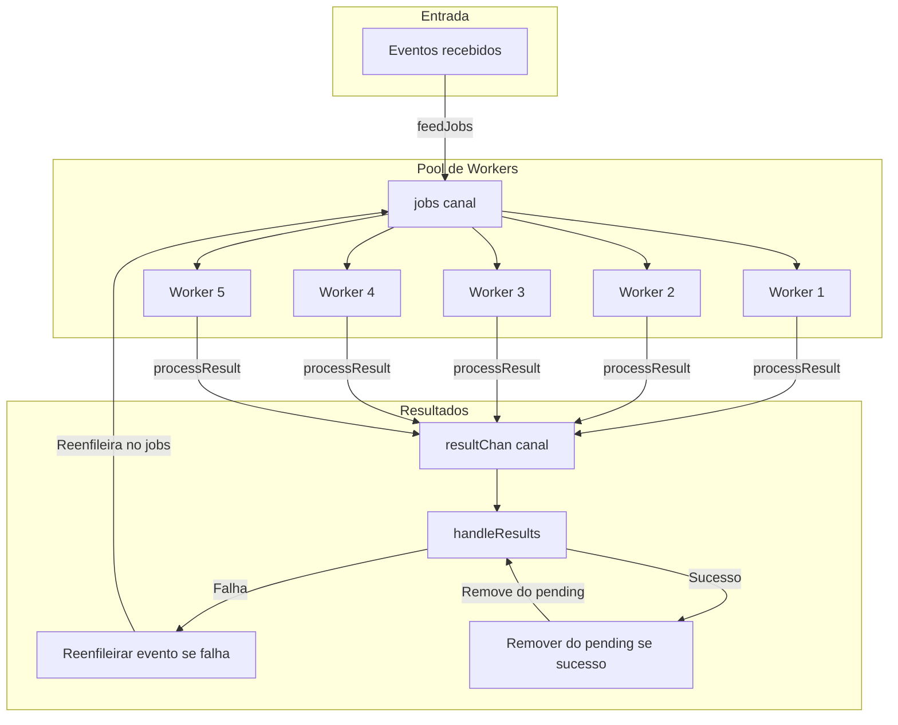

# Fluxo de Trabalho do Worker Pool (Go)

## Descrição
- **feedJobs**: Alimenta o canal jobs com os eventos recebidos.
- **Workers**: Até 5 workers processam eventos em paralelo, retirando do canal jobs.
- **processResult**: Cada worker envia o resultado para o canal resultChan.
- **handleResults**: Consome resultados, remove do pending se sucesso, ou reenfileira no jobs se falha.
- O ciclo se repete até pending ficar vazio.

> Observação: O Mermaid pode apresentar problemas com parênteses em rótulos. Por isso, utilizei "canal" ao invés de "(canal)" nos nós jobs e resultChan.
