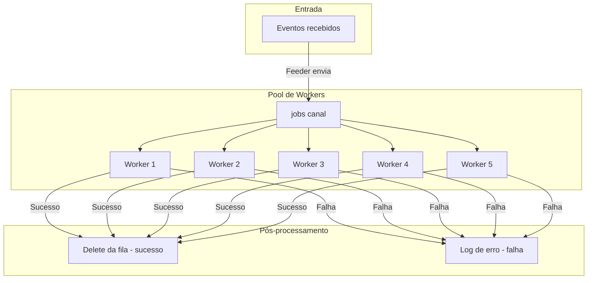

# Fluxo de Trabalho do Worker Pool (Go)

## Descrição
- **Feeder**: Alimenta o canal jobs com os eventos recebidos da fila (SQS, Azure, etc).
- **Workers**: Até N workers processam eventos em paralelo, retirando do canal jobs.
- **Processamento**: Cada worker processa o job. Se sucesso, remove da fila (DeleteMessage). Se falha, apenas loga o erro.
- **Shutdown**: O canal jobs é fechado pelo feeder ao receber sinal externo/contexto, encerrando os workers de forma limpa.

> Observação: O reenfileiramento automático e o controle de "pending" não fazem mais parte do fluxo do WorkerPool. Se necessário, devem ser tratados pela infraestrutura da fila ou lógica externa.
